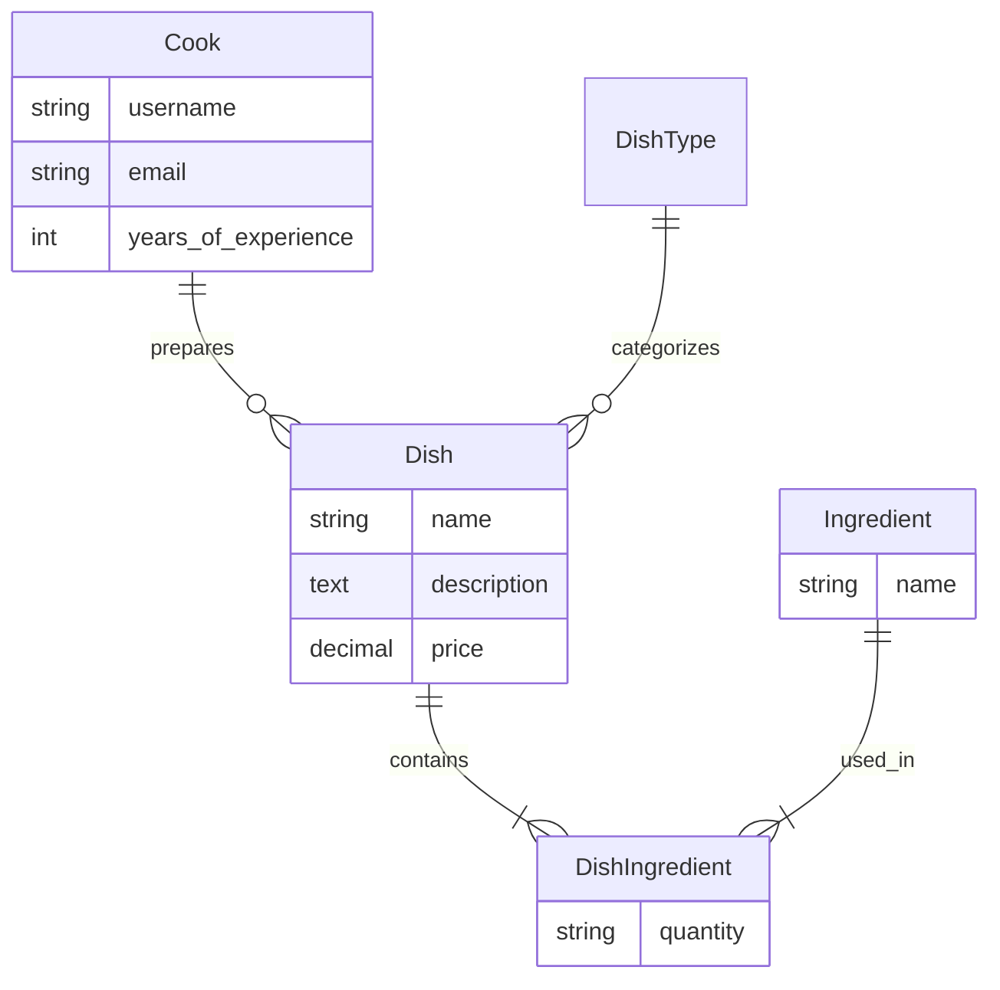
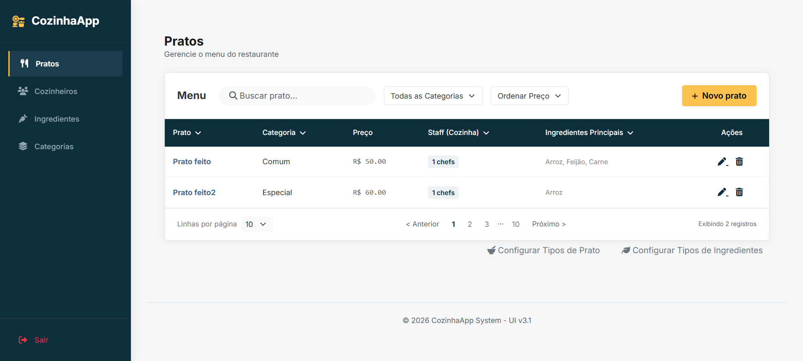
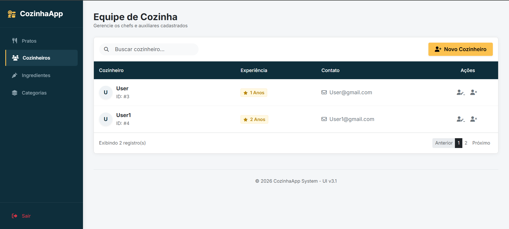
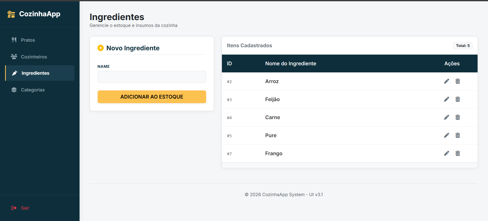
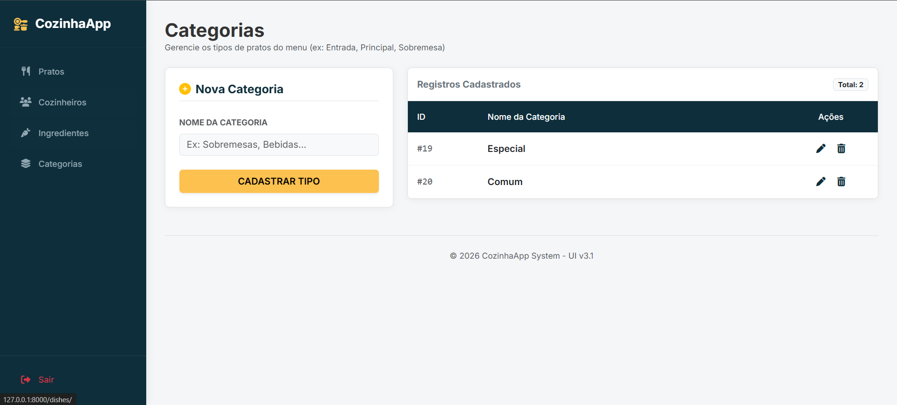

# 🍽️ ChefFlow: Sistema de Gestão Operacional para Restaurantes


Uma aplicação Full Stack desenvolvida para resolver gargalos reais da operação de cozinhas profissionais, focando na gestão de cardápio, controle de insumos e alocação de equipe.

## 🎯 O Problema de Negócio Resolvido
Ambientes de alta pressão como cozinhas comerciais não podem depender de processos manuais lentos. Este projeto foca em **integridade de dados**, **gestão centralizada de receitas** e uma **UI/UX intuitiva** para que chefs e gestores foquem no que importa: a qualidade do serviço.

## 🏗️ Arquitetura e Modelagem de Dados
Para garantir consistência e rastreabilidade, o sistema foi desenhado com um banco de dados relacional robusto. As principais entidades incluem:

*   **Gestão de Cardápio (Dishes):** Controle detalhado de pratos, preços e categorias.
*   **Controle de Insumos (Ingredients):** Relacionamento N:N entre pratos e ingredientes com controle de quantidades específicas.
*   **Gestão de Equipe (Cooks):** Sistema de autenticação customizado para rastrear cozinheiros e seus anos de experiência.

### Diagrama do Banco de Dados


## 🚀 Destaques Técnicos
*   **Django ORM & Modelagem Avançada:** Uso de `ManyToManyField` com tabelas intermediárias (`through`) para gerenciar as quantidades de cada ingrediente em um prato.
*   **Otimização de Queries:** Implementação de `select_related` e `prefetch_related` para reduzir o número de acessos ao banco de dados em listas complexas.
*   **Autenticação Customizada:** Extensão do `AbstractUser` do Django para integrar regras de negócio diretamente no modelo de usuário.
*   **Busca e Filtros Inteligentes:** Implementação de filtros dinâmicos e buscas complexas utilizando objetos `Q` para garantir rapidez na localização de itens.

## 📸 Telas do Sistema

<div align="center">
    <table>
        <tr>
            <td></td>
            <td></td>
        </tr>
        <tr>
            <td></td>
            <td></td>
        </tr>
    </table>
</div>

## ⚙️ Como executar o ambiente
1. Clone o repositório.
2. Crie e ative um ambiente virtual (`python -m venv venv`).
3. Instale o Django (`pip install django`).
4. Execute as migrações para criar o banco de dados local:
   ```bash
   python manage.py migrate
   ```
5. Rode a aplicação:
   ```bash
   python manage.py runserver
   ```

---
**Desenvolvido por [Luan Estifer](https://www.linkedin.com/in/luan-estifer-rodrigues-pereira-7577a2285/)**
